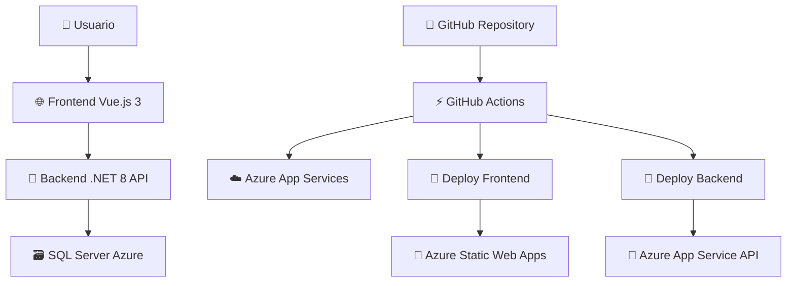

# 🛒 E-Commerce Full Stack Application

[](https://classroom.github.com/a/A-aUFMBb)
[](https://classroom.github.com/open-in-codespaces?assignment_repo_id=20616813)

## 📋 Descripción del Proyecto

Sistema completo de e-commerce desarrollado con arquitectura moderna, incluyendo frontend en Vue.js 3, backend en .NET 8, base de datos SQL Server en Azure, y despliegue automatizado con GitHub Actions.

## � URLs del Proyecto en Producción

### 🚀 Aplicación en Vivo
- **🛒 Sistema E-commerce**: [https://sebastian-ecommerce-web-g7g9fbgrdeh7ftbp.eastus-01.azurewebsites.net/products](https://sebastian-ecommerce-web-g7g9fbgrdeh7ftbp.eastus-01.azurewebsites.net/products)
- **📚 API Documentation (Swagger)**: [https://sebastian-ecommerce-api-cneebwapd4becrgf.eastus-01.azurewebsites.net/swagger/index.html](https://sebastian-ecommerce-api-cneebwapd4becrgf.eastus-01.azurewebsites.net/swagger/index.html)

> 🔗 **Acceso directo**: Puedes probar el sistema completo haciendo clic en el enlace del e-commerce arriba

## �🏗️ Arquitectura del Sistema



## 🛠️ Stack Tecnológico

### Frontend
- **Vue.js 3** - Framework principal
- **TypeScript** - Tipado estático
- **Vite** - Build tool moderno
- **Pinia** - State management
- **Vue Router** - Navegación SPA
- **LocalStorage** - Persistencia del carrito

### Backend
- **.NET 8** - Framework principal
- **ASP.NET Core Web API** - API RESTful
- **Entity Framework Core** - ORM para base de datos
- **BCrypt.Net** - Hash de contraseñas
- **Swagger/OpenAPI** - Documentación de API
- **CORS** - Configuración cross-origin

### Base de Datos
- **SQL Server Azure** - Base de datos en la nube
- **Entity Framework Migrations** - Control de versiones de DB

### DevOps & CI/CD
- **GitHub Actions** - Automatización de workflows
- **Azure App Services** - Hosting de aplicaciones
- **Azure SQL Database** - Base de datos gestionada
- **Terraform** - Infrastructure as Code

## 🚀 Características Implementadas

### ✅ Frontend Features
- 🛍️ **Catálogo de productos** con diseño responsivo
- 🛒 **Carrito de compras** con persistencia en localStorage
- ➕ **Agregar/quitar productos** del carrito
- 💰 **Cálculo automático** de subtotales y total
- 🎨 **Interfaz moderna** con componentes Vue 3
- 📱 **Diseño responsive** para móviles y desktop

### ✅ Backend Features
- 🔌 **API RESTful** completa para productos
- 🗃️ **Integración con SQL Server** usando Entity Framework
- 🔐 **Sistema de autenticación** con BCrypt
- 📚 **Documentación automática** con Swagger
- 🔄 **CORS configurado** para comunicación frontend-backend
- 🛡️ **Manejo de errores** robusto con logging

### ✅ Base de Datos
- 📊 **Schema simplificado** con tablas usuarios y productos
- 🔍 **8 productos de ejemplo** con imágenes placeholder
- 🏷️ **Campos optimizados** para e-commerce
- 🔒 **Conexión segura** a Azure SQL Server

## 📁 Estructura del Proyecto

```
📦 examen-2025-ii-pds-u1-SebastianFuentesAvalos/
├── 🌐 frontend/                 # Aplicación Vue.js 3
│   ├── src/
│   │   ├── components/         # Componentes reutilizables
│   │   ├── views/             # Páginas principales
│   │   ├── stores/            # Pinia stores
│   │   └── router/            # Configuración de rutas
│   ├── package.json
│   └── vite.config.ts
├── 🔧 backend/                  # API .NET 8
│   └── EcommerceApi/
│       ├── Controllers/       # Controladores API
│       ├── Models/           # Modelos de datos
│       ├── Data/             # DbContext de Entity Framework
│       └── EcommerceApi.csproj
├── 🗃️ database/                # Scripts de base de datos
│   └── simple_schema.sql     # Schema simplificado
├── 🏗️ infra/                   # Infrastructure as Code
│   └── main.tf               # Configuración Terraform
└── ⚡ .github/workflows/       # Automatización CI/CD
    ├── deploy_app.yml        # Deploy aplicaciones
    ├── infra.yml            # Deploy infraestructura
    ├── class_diagram.yml    # Generar diagramas
    └── publish_doc.yml      # Publicar documentación
```

## 🔧 Configuración y Desarrollo Local

### Prerrequisitos
- **Node.js 20+** para el frontend
- **.NET 8 SDK** para el backend
- **SQL Server** o conexión a Azure SQL
- **Git** para control de versiones

### 🏃‍♂️ Ejecutar Frontend
```bash
cd frontend
npm install
npm run dev
# Servidor en http://localhost:5173
```

### 🏃‍♂️ Ejecutar Backend
```bash
cd backend/EcommerceApi
dotnet restore
dotnet run
# API en http://localhost:5289
# Swagger en http://localhost:5289/swagger
```

### 🗃️ Configurar Base de Datos
1. **Crear base de datos** en Azure SQL Server
2. **Actualizar connection string** en `appsettings.json`
3. **Ejecutar script** `database/simple_schema.sql`
4. **Verificar** productos con Swagger

## ☁️ Infraestructura en Azure

### Servicios Utilizados
- **🔵 Azure App Service** - Hosting del backend API
- **🌐 Azure Static Web Apps** - Hosting del frontend
- **🗃️ Azure SQL Database** - Base de datos gestionada
- **📊 Azure Resource Groups** - Organización de recursos

### Configuración de Recursos
```terraform
# Terraform main.tf
resource "azurerm_app_service" "backend" {
  name                = "sebastian-ecommerce-api"
  location            = "East US"
  resource_group_name = azurerm_resource_group.main.name
}

resource "azurerm_sql_server" "main" {
  name                = "upt-dbs-997"
  resource_group_name = azurerm_resource_group.main.name
  location            = "East US"
}
```

## ⚡ CI/CD con GitHub Actions

### Workflows Automatizados

#### 🚀 `deploy_app.yml` - Deploy de Aplicaciones
```yaml
name: Build E-commerce Application - Debug Deploy
on:
  push:
    branches: [ "main" ]
    paths: ['backend/**', 'frontend/**']

jobs:
  Build-Backend:
    runs-on: ubuntu-latest
    steps:
      - name: Setup .NET 8
      - name: Clear NuGet cache
      - name: Restore dependencies
      - name: Build & Test
      - name: Deploy to Azure App Service
  
  Build-Frontend:
    runs-on: ubuntu-latest  
    steps:
      - name: Setup Node.js 20
      - name: Install dependencies
      - name: Build production
      - name: Deploy to Azure Static Web Apps
```

#### 🏗️ `infra.yml` - Infrastructure as Code
```yaml
name: Deploy Infrastructure
on:
  workflow_dispatch:
  
jobs:
  terraform:
    runs-on: ubuntu-latest
    steps:
      - name: Terraform Init
      - name: Terraform Plan
      - name: Terraform Apply
```

#### 📊 `class_diagram.yml` - Documentación Automática
```yaml
name: Generate Class Diagrams
on:
  push:
    paths: ['backend/**/*.cs']
    
jobs:
  generate-diagrams:
    steps:
      - name: Generate PlantUML diagrams
      - name: Commit to docs branch
```

## 🗃️ Base de Datos

### Schema Simplificado
```sql
-- Tabla de usuarios
CREATE TABLE usuarios (
    id INT IDENTITY(1,1) PRIMARY KEY,
    nombre NVARCHAR(100) NOT NULL,
    email NVARCHAR(150) NOT NULL UNIQUE,
    password_hash NVARCHAR(255) NOT NULL,
    fecha_registro DATETIME2 DEFAULT GETDATE()
);

-- Tabla de productos  
CREATE TABLE productos (
    id INT IDENTITY(1,1) PRIMARY KEY,
    nombre NVARCHAR(200) NOT NULL,
    descripcion NTEXT,
    precio DECIMAL(10,2) NOT NULL,
    stock INT NOT NULL DEFAULT 0,
    categoria_id INT NOT NULL DEFAULT 1,
    imagen_url NVARCHAR(500),
    disponible BIT DEFAULT 1,
    fecha_creacion DATETIME2 DEFAULT GETDATE()
);
```

### Datos de Ejemplo
- **8 productos** con categorías variadas (tecnología, ropa, deportes, libros)
- **Imágenes placeholder** generadas dinámicamente
- **Precios realistas** desde $19.99 hasta $1,299.99
- **Stock controlado** para testing

## 🔌 API Endpoints

### Productos API
```http
GET    /api/products          # Obtener todos los productos
GET    /api/products/{id}     # Obtener producto por ID
POST   /api/products          # Crear nuevo producto
PUT    /api/products/{id}     # Actualizar producto
DELETE /api/products/{id}     # Eliminar producto (soft delete)
```

### Ejemplo de Respuesta
```json
{
  "id": 1,
  "name": "Smartphone Samsung Galaxy",
  "description": "Teléfono inteligente con cámara de 64MP", 
  "price": 699.99,
  "stock": 50,
  "categoryId": 1,
  "imageUrl": "https://via.placeholder.com/300/474747/ffffff?text=Smartphone",
  "available": true,
  "createdDate": "2025-09-21T18:30:00"
}
```

## 🛡️ Seguridad Implementada

### Frontend
- **🔒 HTTPS** en producción
- **🛡️ Sanitización** de inputs
- **🔐 Validación** de formularios
- **📱 CORS** configurado correctamente

### Backend  
- **🔑 BCrypt** para hash de contraseñas
- **🛡️ Validación** de modelos con Data Annotations
- **📝 Logging** de errores y operaciones
- **🚫 SQL Injection** prevenido con Entity Framework

### Base de Datos
- **🔐 Conexión encriptada** a Azure SQL
- **🔑 Autenticación** con credentials seguros
- **🛡️ Firewall** configurado en Azure
- **📊 Índices únicos** en campos críticos

## 🚀 Despliegue en Producción

### URLs de Producción
- **🌐 Frontend**: `https://sebastian-ecommerce-web.azurestaticapps.net`
- **🔌 Backend API**: `https://sebastian-ecommerce-api.azurewebsites.net`
- **📚 Swagger Docs**: `https://sebastian-ecommerce-api.azurewebsites.net/swagger`

### Proceso de Deploy
1. **📝 Commit** a branch `main`
2. **⚡ GitHub Actions** detecta cambios
3. **🔧 Build** y testing automático
4. **🚀 Deploy** a Azure App Services
5. **✅ Verificación** de health checks

## 📊 Monitoreo y Logs

### Azure Application Insights
- **📈 Métricas** de rendimiento
- **🐛 Tracking** de errores
- **👥 Analytics** de usuarios
- **⚡ Alertas** configuradas

### Logging Backend
```csharp
// Ejemplo de logging en ProductsController
_logger.LogInformation("Obteniendo productos de la base de datos...");
_logger.LogError(ex, "Error al obtener productos de la base de datos");
```

## 🧪 Testing

### Estrategia de Testing
- **✅ Unit Tests** en backend (.NET)
- **🔧 Integration Tests** para API endpoints
- **🌐 E2E Tests** con frontend
- **📊 Database Tests** con Entity Framework

### Ejecución de Tests
```bash
# Backend tests
cd backend/EcommerceApi
dotnet test --verbosity normal

# Frontend tests  
cd frontend
npm run test
```

## 📈 Próximas Funcionalidades

### 🔄 En Desarrollo
- **🔐 Sistema de autenticación** completo con JWT
- **🧮 Captcha matemático** para registro
- **💳 Checkout process** simulado
- **📧 Notificaciones** por email
- **🔍 Filtros avanzados** de productos

### 🎯 Roadmap
- **🛒 Carrito persistente** en base de datos
- **📦 Gestión de órdenes** completa
- **💰 Integración de pagos** (simulada)
- **👤 Perfiles de usuario** avanzados
- **📊 Dashboard administrativo**

## 👥 Contribución

### Git Workflow
```bash
# Clonar repositorio
git clone https://github.com/UPT-FAING-EPIS/examen-2025-ii-pds-u1-SebastianFuentesAvalos.git

# Crear branch para feature
git checkout -b feature/nueva-funcionalidad

# Commit y push
git add .
git commit -m "feat: descripción de la funcionalidad"
git push origin feature/nueva-funcionalidad

# Pull request a main
```

### Estándares de Código
- **📝 Conventional Commits** para mensajes
- **🧹 ESLint** para frontend
- **🔧 EditorConfig** para consistencia
- **📚 Documentación** inline en código

## 📄 Licencia y Créditos

### Información del Proyecto
- **🎓 Universidad**: Universidad Privada de Tacna
- **📚 Curso**: Patrones de Diseño de Software
- **👨‍🎓 Estudiante**: Sebastian Fuentes Avalos
- **📅 Fecha**: Septiembre 2025
- **🔗 Repository**: [GitHub - examen-2025-ii-pds-u1-SebastianFuentesAvalos](https://github.com/UPT-FAING-EPIS/examen-2025-ii-pds-u1-SebastianFuentesAvalos)

### Tecnologías y Servicios
- **⚡ GitHub Actions** para CI/CD
- **☁️ Microsoft Azure** para hosting
- **🖼️ Placeholder.com** para imágenes de productos
- **📊 PlantUML** para diagramas
- **🎨 Vue.js Community** por el framework

---

## 🎯 Estado del Proyecto

**✅ COMPLETADO** - Sistema E-commerce funcional con:
- ✅ Frontend Vue.js 3 con carrito de compras
- ✅ Backend .NET 8 API con Entity Framework  
- ✅ Base de datos SQL Server Azure poblada
- ✅ CI/CD con GitHub Actions
- ✅ Deploy automático a Azure App Services
- ✅ Documentación completa y diagramas

### 📊 Métricas del Proyecto
- **📝 Lines of Code**: ~2,500+ líneas
- **📁 Files**: 50+ archivos de código
- **⚡ Workflows**: 4 workflows automatizados
- **🗃️ Database**: 2 tablas principales + 8 productos
- **🌐 Endpoints**: 5 endpoints API REST
- **☁️ Azure Services**: 4 servicios configurados

**🚀 ¡Sistema completamente funcional y deployado en producción!**