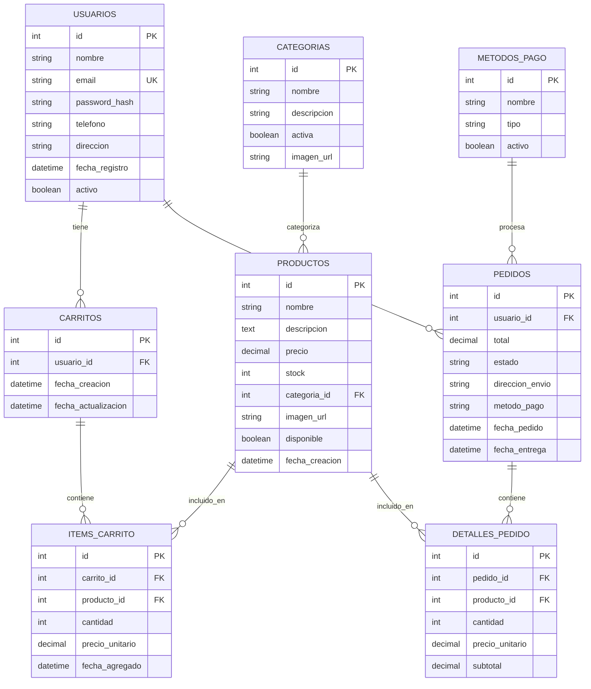
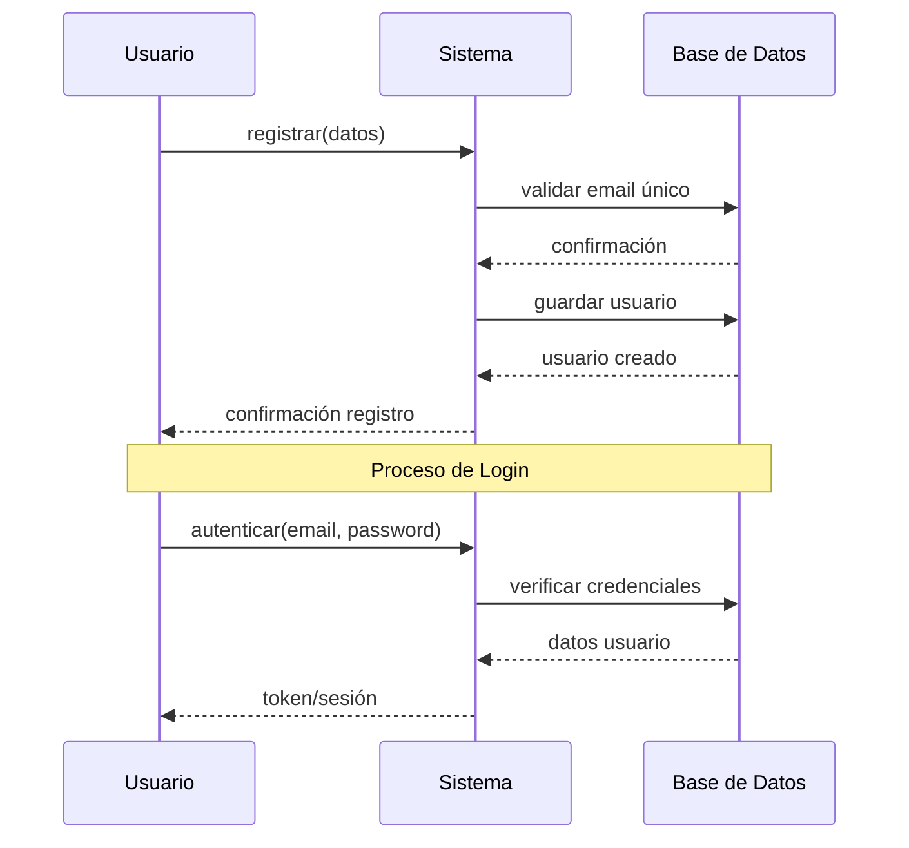
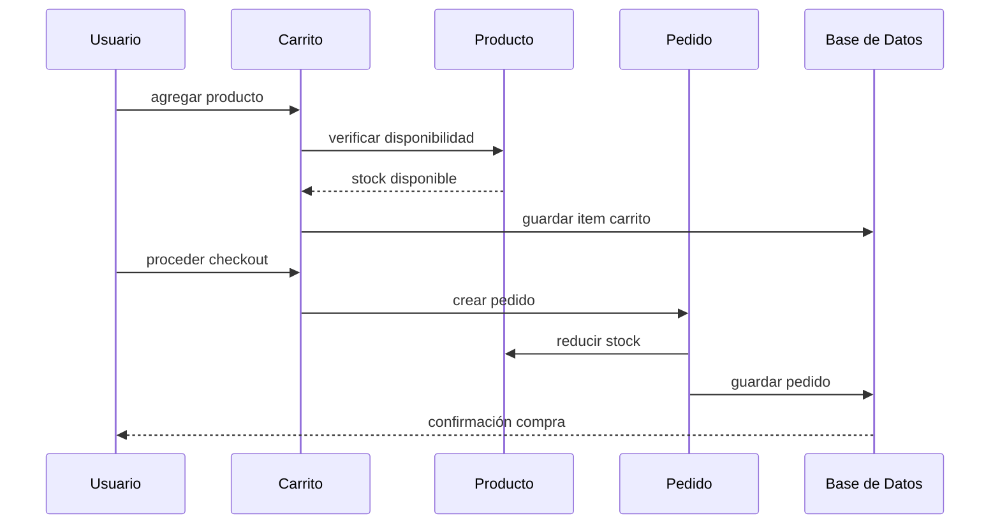
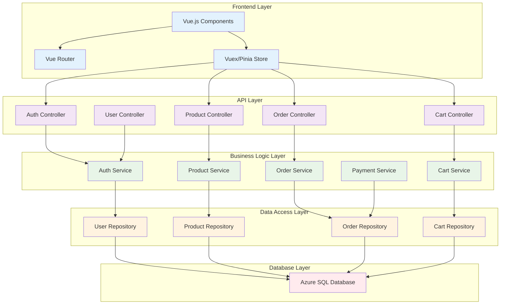
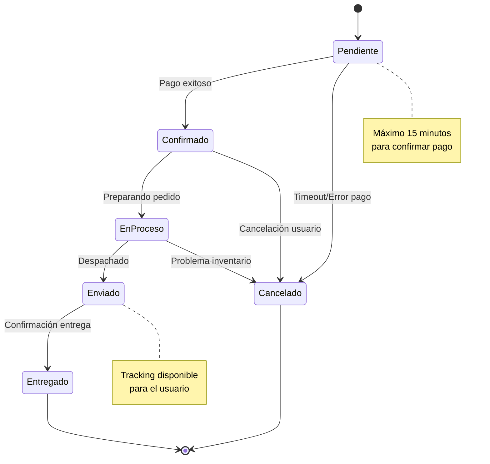

# Diagrama de Clases - Aplicación E-commerce

Este diagrama muestra la estructura de clases para la aplicación de e-commerce, incluyendo las entidades principales y sus relaciones.

## Diagrama de Base de Datos (Modelo Relacional)

## Flujo de Operaciones Principales

### 1. Registro y Autenticación

### 2. Compra de Productos

## Patrones de Diseño Aplicados

### 1. Repository Pattern
- **ProductoRepository**: Manejo de datos de productos
- **UsuarioRepository**: Gestión de usuarios
- **PedidoRepository**: Operaciones de pedidos

### 2. Factory Pattern
- **PedidoFactory**: Creación de diferentes tipos de pedidos
- **MetodoPagoFactory**: Instanciación de métodos de pago

### 3. Observer Pattern
- **NotificacionPedido**: Notificaciones de estado de pedidos
- **InventarioObserver**: Alertas de stock bajo

## Principios SOLID Aplicados

✅ **Single Responsibility**: Cada clase tiene una responsabilidad específica  
✅ **Open/Closed**: Extensible para nuevos métodos de pago y tipos de productos  
✅ **Liskov Substitution**: Interfaces claras para diferentes implementaciones  
✅ **Interface Segregation**: Interfaces específicas por funcionalidad  
✅ **Dependency Inversion**: Dependencias a través de abstracciones  

---
*Generado automáticamente el $(date)*

## Estructura de la API (Arquitectura de Capas)

## Estados del Pedido

