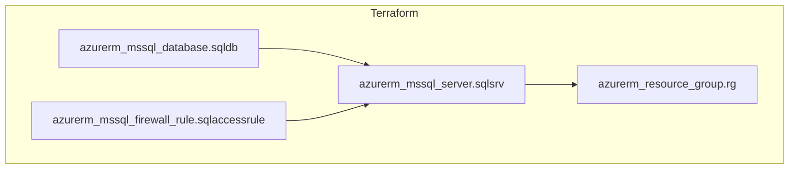
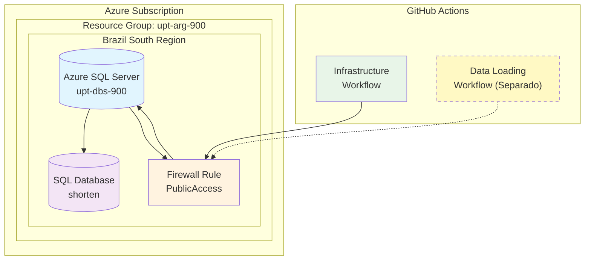

# Diagrama de Infraestructura Azure

Este diagrama muestra la arquitectura de la infraestructura desplegada en Azure usando Terraform.

## Diagrama Terramaid

## Diagrama de Arquitectura

## Componentes Desplegados

### Resource Group: `upt-arg-900`
- **Región:** Brazil South
- **Propósito:** Contenedor de recursos

### SQL Server: `upt-dbs-900`
- **Versión:** 12.0
- **Autenticación:** SQL Server
- **Firewall:** Acceso público (0.0.0.0-255.255.255.255)

### Database: `shorten`
- **SKU:** Basic
- **Propósito:** Almacenar datos de empleo/PIB globales

## Estado de la Infraestructura

✅ **Infraestructura desplegada exitosamente**

### Próximos Pasos
1. ⏳ Ejecutar workflow de carga de datos por separado
2. � Consultar datos una vez cargados

---
*Generado automáticamente el $(date)*
