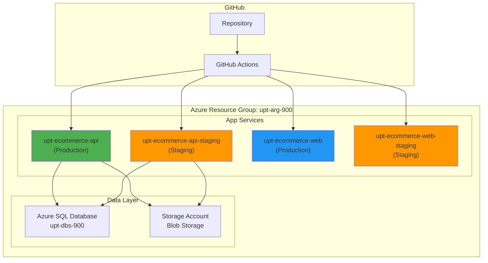

# Configuración Azure App Service para E-commerce

Esta guía te ayudará a configurar Azure App Service para el despliegue automático de la aplicación e-commerce desde GitHub.

## 📋 Requisitos Previos

- Suscripción de Azure activa
- Acceso al portal de Azure
- Repository de GitHub configurado
- Azure CLI instalado (opcional)

## 🏗️ Arquitectura de Despliegue



## 🔧 Paso 1: Crear App Services en Azure Portal

### 1.1 Backend API App Service

1. **Ir al Portal de Azure** → Crear recurso → App Service

2. **Configuración básica:**
   ```
   Subscription: [Tu suscripción]
   Resource Group: upt-arg-900
   Name: upt-ecommerce-api
   Publish: Code
   Runtime stack: .NET 8 (LTS)
   Operating System: Linux
   Region: Brazil South
   ```

3. **Plan de App Service:**
   ```
   Linux Plan (Brazil South): Crear nuevo
   Name: upt-ecommerce-plan
   Sku and size: F1 (Free) para desarrollo
                  B1 (Basic) para producción
   ```

4. **Crear el recurso**

### 1.2 Frontend Static Web App

1. **Crear recurso** → Static Web Apps

2. **Configuración:**
   ```
   Subscription: [Tu suscripción]
   Resource Group: upt-arg-900
   Name: upt-ecommerce-web
   Plan type: Free
   Region: Brazil South
   Source: GitHub
   ```

3. **Conectar con GitHub:**
   ```
   GitHub account: [Tu cuenta]
   Organization: UPT-FAING-EPIS
   Repository: examen-2025-ii-pds-u1-SebastianFuentesAvalos
   Branch: main
   Build Presets: Vue.js
   App location: /frontend
   Output location: dist
   ```

## 🔐 Paso 2: Configurar Secrets en GitHub

Ve a tu repositorio → Settings → Secrets and variables → Actions

### 2.1 Secrets Requeridos

```bash
# Azure Authentication
AZURE_CREDENTIALS='{
  "clientId": "xxxxxxxx-xxxx-xxxx-xxxx-xxxxxxxxxxxx",
  "clientSecret": "xxxxxxxxxxxxxxxxxxxxxxxxxxxxxxxxxxxx",
  "subscriptionId": "xxxxxxxx-xxxx-xxxx-xxxx-xxxxxxxxxxxx",
  "tenantId": "xxxxxxxx-xxxx-xxxx-xxxx-xxxxxxxxxxxx"
}'

# Database Connection
SQL_CONNECTION_STRING="Server=upt-dbs-900.database.windows.net;Database=shorten;User Id=adminuser;Password=Admin1234*;TrustServerCertificate=true;"

# JWT Configuration
JWT_SECRET="tu-jwt-secret-super-seguro-de-al-menos-32-caracteres"

# Azure Storage
AZURE_STORAGE_CONNECTION="DefaultEndpointsProtocol=https;AccountName=uptecommercestorage;AccountKey=xxx;EndpointSuffix=core.windows.net"

# Static Web Apps
AZURE_STATIC_WEB_APPS_API_TOKEN="tu-token-de-static-web-app"
AZURE_STATIC_WEB_APPS_API_TOKEN_STAGING="tu-token-de-staging"
```

### 2.2 Cómo obtener AZURE_CREDENTIALS

```bash
# Crear Service Principal
az ad sp create-for-rbac \
  --name "upt-ecommerce-github-actions" \
  --role contributor \
  --scopes /subscriptions/{subscription-id}/resourceGroups/upt-arg-900 \
  --sdk-auth
```

Esto te dará un JSON que usarás como `AZURE_CREDENTIALS`.

### 2.3 Cómo obtener Static Web Apps Token

1. Ve a tu Static Web App en Azure Portal
2. Settings → Configuration → Manage deployment token
3. Copia el token generado

## ⚙️ Paso 3: Configurar App Settings en Azure

### 3.1 Backend App Service Configuration

En Azure Portal → Tu App Service → Configuration → Application settings:

```bash
# Environment
ASPNETCORE_ENVIRONMENT=Production

# Database
ConnectionStrings__DefaultConnection={SQL_CONNECTION_STRING}

# JWT
JWT__SecretKey={JWT_SECRET}
JWT__Issuer=https://upt-ecommerce-api.azurewebsites.net
JWT__Audience=https://upt-ecommerce-web.azurewebsites.net
JWT__ExpiryInMinutes=60

# Azure Storage
AzureStorage__ConnectionString={AZURE_STORAGE_CONNECTION}
AzureStorage__ContainerName=product-images

# CORS (si es necesario)
CORS__AllowedOrigins=https://upt-ecommerce-web.azurewebsites.net

# Logging
Logging__LogLevel__Default=Information
Logging__LogLevel__Microsoft.AspNetCore=Warning
```

### 3.2 Connection Strings

Agregar en la sección Connection strings:

```bash
Name: DefaultConnection
Value: Server=upt-dbs-900.database.windows.net;Database=shorten;User Id=adminuser;Password=Admin1234*;TrustServerCertificate=true;
Type: SQLServer
```

## 🚀 Paso 4: Configurar Deployment Slots (Staging)

### 4.1 Crear Slot de Staging

```bash
az webapp deployment slot create \
  --name upt-ecommerce-api \
  --resource-group upt-arg-900 \
  --slot staging
```

### 4.2 Configurar Slot de Staging

```bash
# Configurar app settings para staging
az webapp config appsettings set \
  --name upt-ecommerce-api \
  --resource-group upt-arg-900 \
  --slot staging \
  --settings \
    ASPNETCORE_ENVIRONMENT=Staging \
    "ConnectionStrings__DefaultConnection={staging-connection-string}"
```

## 🔍 Paso 5: Configurar Health Checks

### 5.1 En el código .NET (Program.cs)

```csharp
// Health checks
builder.Services.AddHealthChecks()
    .AddSqlServer(connectionString)
    .AddAzureBlobStorage(storageConnectionString);

// En el pipeline
app.MapHealthChecks("/health");
app.MapHealthChecks("/health/ready", new HealthCheckOptions()
{
    Predicate = check => check.Tags.Contains("ready"),
});
```

### 5.2 Configurar en Azure

Azure Portal → App Service → Health check:
```
Health check path: /health
```

## 📊 Paso 6: Configurar Monitoreo

### 6.1 Application Insights

1. **Crear Application Insights:**
   ```bash
   az monitor app-insights component create \
     --app upt-ecommerce-insights \
     --location "Brazil South" \
     --resource-group upt-arg-900
   ```

2. **Conectar con App Service:**
   ```bash
   APPINSIGHTS_INSTRUMENTATIONKEY="tu-instrumentation-key"
   APPLICATIONINSIGHTS_CONNECTION_STRING="InstrumentationKey=xxx"
   ```

### 6.2 Alertas y Métricas

Configurar alertas para:
- CPU > 80%
- Memory > 80%
- Response time > 5s
- Error rate > 5%

## 🔧 Paso 7: Configuración de Red y Seguridad

### 7.1 Custom Domain (Opcional)

```bash
# Agregar dominio personalizado
az webapp config hostname add \
  --webapp-name upt-ecommerce-api \
  --resource-group upt-arg-900 \
  --hostname api.tudominio.com

# SSL Certificate
az webapp config ssl bind \
  --certificate-thumbprint {thumbprint} \
  --ssl-type SNI \
  --name upt-ecommerce-api \
  --resource-group upt-arg-900
```

### 7.2 Firewall Rules para SQL

```bash
# Permitir acceso desde App Service
az sql server firewall-rule create \
  --resource-group upt-arg-900 \
  --server upt-dbs-900 \
  --name AllowAppService \
  --start-ip-address 0.0.0.0 \
  --end-ip-address 0.0.0.0
```

## ✅ Paso 8: Validar Configuración

### 8.1 Test de Endpoints

```bash
# Backend API Health Check
curl https://upt-ecommerce-api.azurewebsites.net/health

# Frontend
curl https://upt-ecommerce-web.azurewebsites.net

# API Endpoints
curl https://upt-ecommerce-api.azurewebsites.net/api/products
```

### 8.2 Test de Deployment

1. Hacer un cambio en el código
2. Push a main branch
3. Verificar que el workflow se ejecute
4. Validar deployment en staging
5. Promover a producción

## 🚨 Troubleshooting

### Problemas Comunes

1. **Deployment Failed:**
   ```bash
   # Ver logs del App Service
   az webapp log tail --name upt-ecommerce-api --resource-group upt-arg-900
   ```

2. **Database Connection Issues:**
   - Verificar firewall rules en SQL Server
   - Validar connection string
   - Revisar que la base de datos exista

3. **Static Web App Issues:**
   - Verificar build configuration
   - Revisar app location y output location
   - Validar API token

4. **CORS Errors:**
   - Configurar origins permitidos en backend
   - Verificar headers en requests

### Comandos Útiles

```bash
# Restart App Service
az webapp restart --name upt-ecommerce-api --resource-group upt-arg-900

# Ver configuración actual
az webapp config show --name upt-ecommerce-api --resource-group upt-arg-900

# Stream logs en tiempo real
az webapp log tail --name upt-ecommerce-api --resource-group upt-arg-900

# Ver métricas
az monitor metrics list --resource upt-ecommerce-api --resource-group upt-arg-900
```

## 📈 Optimizaciones de Producción

### 1. Scaling Automático

```bash
az monitor autoscale create \
  --resource-group upt-arg-900 \
  --resource upt-ecommerce-api \
  --min-count 1 \
  --max-count 3 \
  --count 1
```

### 2. CDN para Frontend

```bash
az cdn profile create \
  --name upt-ecommerce-cdn \
  --resource-group upt-arg-900 \
  --sku Standard_Microsoft
```

### 3. Backup de Base de Datos

```bash
az sql db export \
  --admin-user adminuser \
  --admin-password Admin1234* \
  --storage-key-type StorageAccessKey \
  --storage-key {storage-key} \
  --storage-uri https://uptstorage.blob.core.windows.net/backups/backup.bacpac \
  --name shorten \
  --resource-group upt-arg-900 \
  --server upt-dbs-900
```

---

## 🎯 Checklist de Configuración

- [ ] App Service Backend creado
- [ ] Static Web App Frontend creado  
- [ ] Secrets configurados en GitHub
- [ ] Service Principal creado
- [ ] App Settings configurados
- [ ] Deployment slots configurados
- [ ] Health checks habilitados
- [ ] Application Insights configurado
- [ ] SSL/Custom domain configurado (opcional)
- [ ] Firewall rules configurados
- [ ] Workflow de GitHub Actions funcionando
- [ ] Tests de deployment exitosos

¡Con esta configuración tendrás un pipeline de CI/CD completo para tu aplicación e-commerce en Azure! 🚀